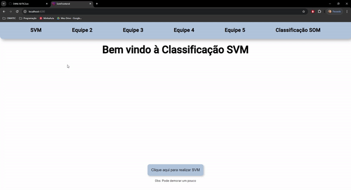
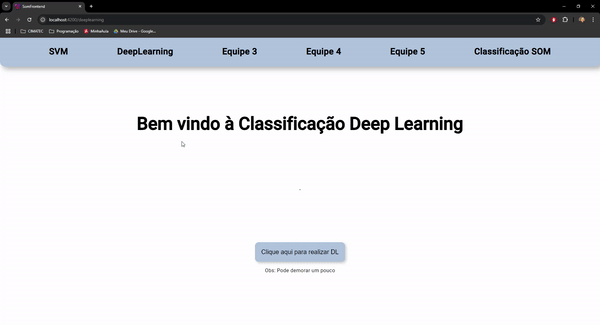
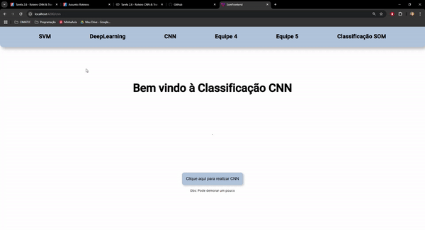
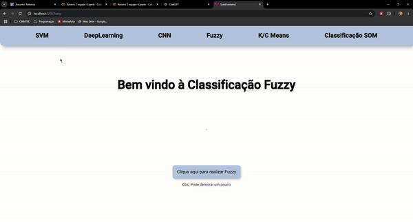
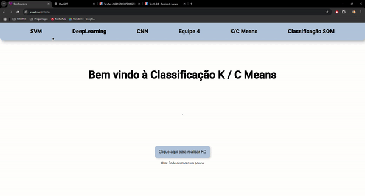
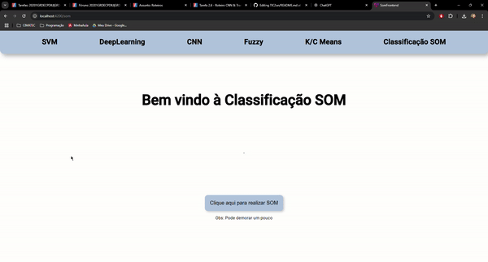

# Projeto Tópicos Avançados em Inteligência Computacional - 2° Unidade
## Centro Universitário SENAI CIMATEC
### Daniel André Marinho, Felipe Ribeiro, Natália Ohana


## Requisitos

A ideia original da atividade é desenvolver códigos de algoritmos de classificação. Cada equipe apresentará um tipo de classificação, além de criar um roteiro de como utilizar o algoritmo apresentado. Com isso, cada equipe deve seguir o roteiro para aplicar os conhecimentos obtidos nas aulas.

## Solução

De acordo com o problema apresentado acima, foram desenvolvidas soluções em Python referentes a cada algoritmo apresentado em sala. Como adicional, a equipe desenvolveu um ambiente de execução utilizando Flask, com o objetivo de enviar os resultados obtidos em cada código para um frontend, desenvolvido com o Framework Angular. O repositório contém tanto o frontend quanto o backend, separados em suas respectivas pastas dentro da root principal do projeto.

## Arquitetura do Backend

O backend segue o padrão de arquitetura REST em camadas, organizado dentro de `backend/`:

```
backend/
├── app.py                   # Entry point único — cria o Flask, registra os Blueprints e executa
├── config.py                # Configurações globais (paths de modelos e imagens)
│
├── models/                  # DTOs (Data Transfer Objects) com dataclasses Python
│   ├── svm_model.py
│   ├── dl_model.py
│   ├── cnn_model.py
│   ├── clustering_model.py
│   ├── fuzzy_model.py
│   └── som_model.py
│
├── repositories/            # Gerenciamento de estado em memória
│   ├── svm_repository.py
│   ├── dl_repository.py
│   ├── cnn_repository.py
│   ├── clustering_repository.py
│   ├── fuzzy_repository.py
│   └── som_repository.py
│
├── services/                # Lógica de negócio e algoritmos de ML
│   ├── svm_service.py
│   ├── dl_service.py
│   ├── cnn_service.py
│   ├── clustering_service.py
│   ├── fuzzy_service.py
│   └── som_service.py
│
├── controllers/             # Rotas HTTP (Flask Blueprints)
│   ├── svm_controller.py
│   ├── dl_controller.py
│   ├── cnn_controller.py
│   ├── clustering_controller.py
│   ├── fuzzy_controller.py
│   └── som_controller.py
│
├── weights/                 # Pesos e modelos (pré-treinados + gerados em runtime)
│   ├── svm/                 # Modelo SVM salvo após treinamento
│   ├── cnn_tf/models/       # Pesos CNN TensorFlow (VGG16)
│   ├── cnn_ft/models/       # Pesos CNN Fine-Tuning
│   └── neurofuzzy/          # Pesos ANFIS (NeuroFuzzy)
│
├── images/                  # Imagens geradas pelos algoritmos (saída)
│   ├── cnn_tf/
│   └── cnn_ft/
│
└── results/                 # GIFs de demonstração
```

## Como Executar

```bash
cd backend
python app.py
```

## Endpoints da API

| Método | Rota | Descrição |
|--------|------|-----------|
| POST | `/svm/run` | Executa o algoritmo SVM |
| GET | `/svm/results` | Retorna accuracy e URL da imagem |
| GET | `/svm/image` | Retorna a matriz de confusão (PNG) |
| POST | `/dl/train` | Treina TensorFlow e PyTorch em paralelo |
| GET | `/dl/image/tf` | Matriz de confusão do modelo TensorFlow |
| GET | `/dl/image/pt` | Matriz de confusão do modelo PyTorch |
| GET | `/dl/accuracy/tf` | Accuracy do modelo TensorFlow |
| GET | `/dl/accuracy/pt` | Accuracy do modelo PyTorch |
| POST | `/cnn/predict` | Executa predição com CNN (VGG16) |
| GET | `/cnn/image` | Matriz de confusão CNN |
| GET | `/cnn/accuracy` | Métricas (accuracy + f1) CNN |
| POST | `/cnn_finetunning/predict` | Executa predição com CNN Fine-Tuning |
| GET | `/cnn_finetunning/image` | Matriz de confusão Fine-Tuning |
| GET | `/cnn_finetunning/accuracy` | Métricas Fine-Tuning |
| POST | `/k/run` | Executa K-Means |
| GET | `/k/image` | Gráfico do Método do Cotovelo |
| POST | `/c/run` | Executa Fuzzy C-Means |
| GET | `/c/image` | Gráfico dos clusters C-Means |
| POST | `/nf/run` | Treina o modelo NeuroFuzzy (ANFIS) |
| GET | `/nf/image` | Gráfico de predição ANFIS |
| POST | `/f/run` | Executa o sistema Fuzzy (temperatura + umidade) |
| GET | `/f/image` | Visualização das funções de pertinência |
| POST | `/som/train` | Treina SOM Manual e MiniSom |
| GET | `/som/get-image/<som_type>` | Imagem do SOM (`manual` ou `minisom`) |
| GET | `/som/get-accuracy/<som_type>` | Accuracy do SOM |

## Algoritmos

### SVM

O primeiro algoritmo solicitado foi o SVM (Máquinas de Vetores-Suporte). A classificação ocorreu na base de dados Iris, da biblioteca Sklearn, e aplicou a função SVC da mesma biblioteca para realizar a classificação, após o tratamento adequado dos dados. O algoritmo completo será executado dentro de um Post, que receberá o comando do frontend para execução. Os resultados serão enviados para o frontend através de duas requisições Get, sendo uma para a imagem da matriz confusão e outra para os resultados de precisão do algoritmo.



### Deep Learning

O segundo método apresentado foi o Deep Learning, no qual foram solicitadas 2 aplicações diferentes, sendo uma delas através da biblioteca PyTorch e outra utilizando TensorFlow. A partir disso, foi realizado o treinamento de ambos os algoritmos para a classificação da biblioteca Iris, e apresentado na tela do sistema a matriz confusão e a accuracy de ambos, a fins comparativos.



### CNN

O terceiro roteiro solicitava dois algoritmos de CNN (Tensorflow e FineTunning), que deveriam, cada um, incluir 2 arquivos, sendo um deles responsável pelo treinamento da rede e armazenamento dos pesos obtidos (treino), e o segundo deve ler estes pesos e executar o algoritmo com base nisso (teste). Com isso, foi criada uma requisição post, que solicita o teste utilizando os pesos, e duas requisições get, que enviam a matriz confusão e as métricas do algoritmo para o frontend.



### Fuzzy Sistems

A quarta equipe solicitou 2 roteiros, sendo o primeiro deles referente a um algoritmo utilizando NeuroFuzzy, e o segundo, utilizando Fuzzy. Foram desenvolvidos dois algoritmos separados em pastas individuais, tendo, cada um, um post para executar o algoritmo e um get para enviar a imagem do gráfico ao frontend.



### Aprendizagem não Supervisionada

A quinta equipe solicitou 2 roteiros, sendo o primeiro deles referente a um algoritmo utilizando K-means, e o segundo, utilizando C-Means. Foram desenvolvidos dois algoritmos separados em pastas individuais, tendo, cada um, um post para executar o algoritmo e um get para enviar a imagem do gráfico ao frontend.



### SOM
Por ultimo, nossa equipe (equipe 6) foi responsável por dois roteiros, ambos referentes a algoritmos SOM, sendo um deles utilizando a biblioteca externa Minisom, e o segundo desenvolvendo um algoritmo SOM manualmente, com base nas etapas propostas pela teoria do algoritmo.


