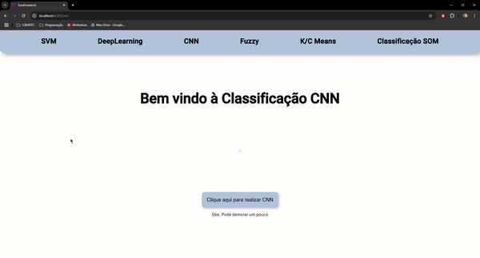

# Projeto Tópicos Avançados em Inteligência Computacional - 2° Unidade
## Centro Universitário SENAI CIMATEC
### Daniel André Marinho, Felipe Ribeiro, Natália Ohana

## Requisitos

A ideia original da atividade é desenvolver códigos de algoritmos de classificação. Cada equipe apresentará um tipo de classificação, além de criar um roteiro de como utilizar o algoritmo apresentado. Com isso, cada equipe deve seguir o roteiro para aplicar os conhecimentos obtidos nas aulas.

## Solução

De acordo com o problema apresentado acima, foram desenvolvidas soluções em Python referentes a cada algoritmo apresentado em sala. Como adicional, a equipe desenvolveu um ambiente de execução utilizando Flask, com o objetivo de enviar os resultados obtidos em cada código para um frontend, desenvolvido com o Framework Angular. O repositório contém tanto o frontend quanto o backend, separados em suas respectivas pastas dentro da root principal do projeto. Para visualizar cada algoritmo individualmente, acesse a pasta backend/Roteiros_Individuais e busque pelo algoritmo desejado seguindo o nome dos arquivos, ou acesse backend_main.py para visualizar o backend completo com todos os algoritmos

## Algoritmos

### SVM

O primeiro algoritmo solicitado foi o SVM (Máquinas de Vetores-Suporte). A classificação ocorreu na base de dados Iris, da biblioteca Sklearn, e aplicou a função SVC da mesma biblioteca para realizar a classificação, após o tratamento adequado dos dados. O algoritmo completo será executado dentro de um Post, que receberá o comando do frontend para execução. Os resultados serão enviados para o frontend através de duas requisições Get, sendo uma para a imagem da matriz confusão e outra para os resultados de precisão do algoritmo.

### Deep Learning

O segundo método apresentado foi o Deep Learning, no qual foram solicitadas 2 aplicações diferentes, sendo uma delas através da biblioteca PyTorch e outra utilizando TensorFlow. A partir disso, foi realizado o treinamento de ambos os algoritmos para a classificação da biblioteca Iris, e apresentado na tela do sistema a matriz confusão e a accuracy de ambos, a fins comparativos.

### CNN

O terceiro roteiro solicitava dois algoritmos de CNN (Tensorflow e FineTunning), que deveriam, cada um, incluir 2 arquivos, sendo um deles responsável pelo treinamento da rede e armazenamento dos pesos obtidos (treino), e o segundo deve ler estes pesos e executar o algoritmo com base nisso (teste).  Com isso, foi criada uma requisição post, que solicita o teste utilizando os pesos, e duas requisições get, que enviam a matriz confusão e as métricas do algoritmo para o frontend.

### Fuzzy Sistems

A quarta equipe solicitou 2 roteiros, sendo o primeiro deles referente a um algoritmo utilizando NeuroFuzzy, e o segundo, utilizando Fuzzy. Foram desenvolvidos dois algoritmos separados em pastas individuais, tendo, cada um, um post para executar o algoritmo e um get para enviar a imagem do gráfico ao frontend.

### Aprendizagem não Supervisionada

A quinta equipe solicitou 2 roteiros, sendo o primeiro deles referente a um algoritmo utilizando K-means, e o segundo, utilizando C-Means. Foram desenvolvidos dois algoritmos separados em pastas individuais, tendo, cada um, um post para executar o algoritmo e um get para enviar a imagem do gráfico ao frontend.

### SOM
Por ultimo, nossa equipe (equipe 6) foi responsável por dois roteiros, ambos referentes a algoritmos SOM, sendo um deles utilizando a biblioteca externa Minisom, e o segundo desenvolvendo um algoritmo SOM manualmente, com base nas etapas propostas pela teoria do algoritmo.

